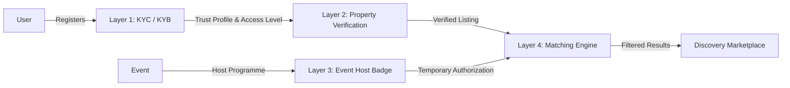

# AFCON360 Trust & Discovery Architecture: Comprehensive Implementation Guide

## Executive Summary

AFCON360 implements a robust, modular 4-layer Trust and Discovery Architecture designed to maintain strict separation of concerns across identity management, property verification, event host temporary badging, and multi-marketplace matching. 

This document details how each of the four systems is implemented, their state machines, database ownership boundaries, and inter-module service contracts.

---

## Architecture Overview & Core Principle

The foundational rule of the AFCON360 trust architecture is **absolute modular separation**:
- **Layer 1 (Identity KYC/KYB)** answers: *"Who is this person or organization?"*
- **Layer 2 (Property Verification)** answers: *"Is this accommodation listing legitimate and safe?"*
- **Layer 3 (Event Host Badge)** answers: *"Is this property allowed to participate in this particular event?"*
- **Layer 4 (Event Accommodation Matching)** answers: *"Which accommodation options should this event audience see?"*

### Architectural Flow & Separation Diagram


---

## Layer 1: Identity KYC / KYB (`identity` module)

### Purpose & Gatekeeping
The identity layer acts as the foundational gatekeeper. It verifies individual users (KYC) and corporate entities / hotel companies (KYB) before granting operational privileges across the platform.

### Data Models & Profiles
- **User / Organization Models** (`app/identity/models/`): Store legal names, registration numbers, tax IDs (TIN), statutory documents (e.g., URSB certificates), and controller structures.
- **Trust Profile & Levels**:
  - `KYC Status`: `PENDING`, `VERIFIED`, `REJECTED`, `EXPIRED`.
  - `KYC Level`: `Level 1` (Basic contact) to `Level 3` (Enhanced institutional).
  - Privileges unlocked: Property creation, payment receipts, event participation partnerships.

### Service Contract (`IdentityService` / `KYCService`)
Exposes read-only trust verification checks consumed by other modules:
```python
class IdentityService:
    @staticmethod
    def verify_user_trust(user_public_id: str) -> dict:
        """Returns trust profile, verification level, and active status."""
        ...
```

---

## Layer 2: Property Verification Engine (`accommodation` module)

### Purpose & Independence
Properties exist completely independently of events (`app/accommodation/models/property.py`). A verified user can own a property, but property legitimacy is assessed entirely on its own merits (location, photos, ownership proof, compliance).

### Property Lifecycle State Machine
```
DRAFT
  ↓
SUBMITTED
  ↓
SYSTEM_CHECKS (Automated Checks)
  ↓
UNDER_REVIEW ────────┬────────► NEEDS_INFORMATION ──► OWNER_UPDATE ──► UNDER_REVIEW
  │
  ├─► ACTIVE
  │     ↓
  │   SUSPENDED
  │     ↓
  └─► ARCHIVED
```

### Automated System Checks vs. Moderator Exception Queues
Before reaching human moderators, the `PropertyVerificationEngine` runs automated validation:
1. Owner KYC/KYB validity check (via Layer 1 contract).
2. Mandatory fields & asset completeness.
3. Geo-coordinate existence & duplicate listing detection.
4. Pricing anomaly detection & content safety / fraud signals.

Low-risk listings proceed to automatic activation (`ACTIVE`), while flagged listings enter the moderator exception queue.

---

## Layer 3: Event Host Badge System (`events` & `accommodation` integration)

### Purpose & Temporary Authorization
Event host badges provide time-bound, event-specific authorizations without altering the underlying permanent property status (`ACTIVE`, `SUSPENDED`, etc.).

### Database Ownership Boundary (`EventHostRegistration`)
To avoid reverse ownership (where events own properties), properties are linked to events via an independent association/badge table:
```python
# app/events/models/host_registration.py (Conceptual)
class EventHostRegistration(BaseModel):
    __tablename__ = 'event_host_registrations'
    property_id = Column(BigInteger, ForeignKey('properties.id'))
    event_id = Column(BigInteger, ForeignKey('events.id'))
    badge_type = Column(String(50)) # e.g., 'Official AFCON Community Host', 'Event Partner'
    status = Column(String(30))     # CREATED, INVITED, ACCEPTED, VERIFIED, ACTIVE, EXPIRED
    valid_from = Column(DateTime)
    valid_until = Column(DateTime)
```

### Badge Lifecycle
```
CREATED → INVITED → ACCEPTED → VERIFIED → ACTIVE → EXPIRED
```

---

## Layer 4: Event Accommodation Matching & Discovery Engine

### Multi-Marketplace Discovery Synthesis
The discovery engine (`app/accommodation/services/marketplace_service.py`) queries all three upstream layers to construct tailored recommendations across AFCON360's three distinct marketplaces:

1. **Normal Accommodation Marketplace**: Permanent supply (Hotels, Lodges, Apartments).
2. **Event Accommodation Marketplace**: Temporary demand matching (Sports tournaments, festivals, conferences).
3. **Community Capacity Marketplace**: Flexible peer supply (Homes, rooms, community hosts).

### Matching Algorithm Pipeline
```python
def discover_event_accommodations(event_id: int, criteria: dict):
    # 1. Query verified and active properties from Property Verification Engine (Layer 2)
    properties = Property.query.filter_by(status='ACTIVE', is_deleted=False).all()
    
    # 2. Filter by owner identity trust status via IdentityService (Layer 1)
    trusted_properties = [p for p in properties if IdentityService.is_trusted(p.owner_id)]
    
    # 3. Incorporate event host badge authorizations for the specific event (Layer 3)
    matched_results = []
    for prop in trusted_properties:
        badge = EventHostRegistration.query.filter_by(
            property_id=prop.id, 
            event_id=event_id, 
            status='ACTIVE'
        ).first()
        
        matched_results.append({
            'property': prop,
            'host_badge': badge,
            'marketplace_type': 'Event Partner' if badge else 'Normal'
        })
        
    return matched_results
```

---

## Summary of Data Contracts & Isolation

| Layer | System | Primary Module | Key Data Artifacts | Consumed By |
|-------|--------|----------------|-------------------|-------------|
| **Layer 1** | Identity KYC/KYB | `app/identity` | Trust Profile, KYC Level, Status | Accommodation, Events, Wallet |
| **Layer 2** | Property Verification | `app/accommodation` | Property, Verification State | Matching Engine |
| **Layer 3** | Event Host Badge | `app/events` & `app/accommodation` | `EventHostRegistration` | Matching Engine |
| **Layer 4** | Matching & Discovery | `app/accommodation` | Multi-Marketplace Results | End-user Discovery UI |
