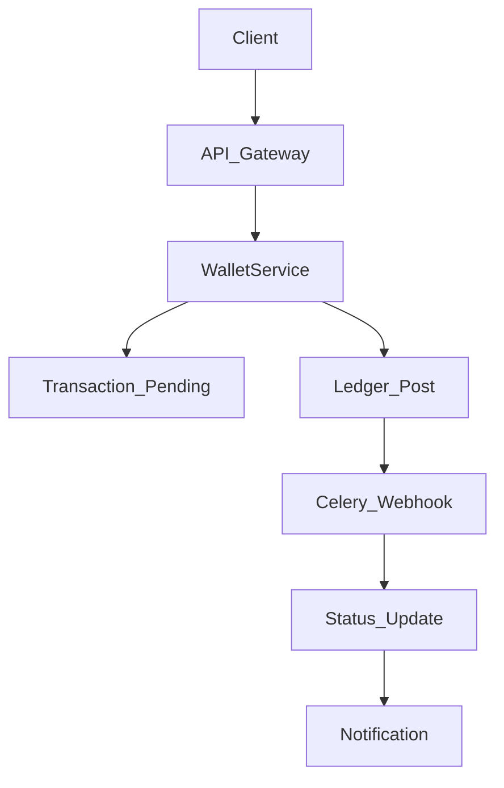

# AFCON360 Wallet System — Production Guide

**Last Updated:** July 2026
**Status:** Production-ready with tracked remediation items
**Purpose:** Single source of truth for engineers supporting, debugging, or extending the wallet system.

---

## 1. System Overview

The AFCON360 Wallet uses a **double-entry ledger architecture** where balances are derived from `LedgerEntryModel` (never stored directly). Core guarantees:

- Atomic transactions with PostgreSQL `SELECT FOR UPDATE`
- Idempotency via `client_request_id` (unique DB constraint)
- Pending record creation before any mutation
- Webhooks as the source of truth (processed via Celery)
- Repository pattern for data access
- All money math uses `Decimal` / `Numeric(18,6)` — never `float`

---

## 2. Architecture at a Glance

```
app/wallet/
├── models/               # SQLAlchemy models (UUID PKs, String status, CHECK constraints)
│   ├── ledger.py         # LedgerEntryModel, AccountModel
│   ├── transaction.py    # TransactionModel (idempotency via client_request_id)
│   ├── audit.py          # AuditLogModel, IdempotencyKeyModel
│   ├── webhook_event.py  # WebhookEvent (ProtectedModel)
│   ├── config.py         # PaymentProviderConfig, WalletSystemConfig
│   ├── fx.py             # FXRateModel, FXTransactionModel
│   ├── payout.py         # PayoutRequest
│   ├── commission.py     # AgentCommission
│   ├── nonce_protection.py # UserNonce, NonceProtectionConfig
│   ├── fraud_detection.py  # FraudDetectionConfig
│   ├── aggregator.py     # Aggregator model
│   ├── reconciliation.py # ReconciliationRun, ReconciliationIssue
│   ├── admin_audit.py    # AdminAuditLog
│   └── travel_rule.py    # TravelRuleConfig, TravelRuleTransfer
├── repositories/         # Thin data-access layer
│   ├── ledger_repository.py    # Balance derivation, volume queries
│   ├── transaction_repository.py # Atomic idempotency (ON CONFLICT)
│   ├── account_repository.py   # Atomic account CRUD + row locking
│   ├── payout_repository.py
│   ├── commission_repository.py
│   └── webhook_repository.py
├── services/             # Business logic
│   ├── wallet_service.py       # CORE: deposit, withdraw, transfer, get_balance
│   ├── wallet_status_service.py # WalletFeature, WalletTier, WalletStatus
│   ├── payment_gateway.py      # Multi-provider gateway (Flutterwave, Paystack)
│   ├── webhook_service.py
│   ├── fx_service.py           # FX rate safety, deviation detection
│   ├── currency_service.py     # Currency conversion with caching
│   ├── payout_service.py
│   ├── commission_service.py
│   ├── nonce_protection_service.py
│   ├── fraud_detection_service.py
│   ├── compliance_engine.py     # AML/KYC/sanctions rules
│   ├── wallet_notifications.py
│   └── regulator_service.py
├── middleware/            # Cross-cutting concerns
│   ├── idempotency.py    # Redis + PostgreSQL idempotency middleware
│   ├── wallet_check.py   # Feature-access decorators
│   └── kill_switch.py    # Wallet module disable toggle
├── api/                   # REST JSON endpoints
│   ├── wallet_api.py     # /api/wallet/*
│   └── fx_api.py         # /api/fx/*
├── routes/                # HTML page routes
│   └── regulator_api.py  # Regulator + aggregator API
└── routes.py             # Main blueprint (HTML pages + /api/balance, etc.)
```

---

## 3. Core Models Quick Reference

| Model | Table | PK | Key Fields | Purpose |
|-------|-------|----|------------|---------|
| `LedgerEntryModel` | `ledger_entries` | UUID `id` | `transaction_id`, `account_id`, `entry_type` (CREDIT/DEBIT), `amount`, `currency`, `meta` (JSONB) | Immutable source of truth for all balances. Never updated or deleted. |
| `AccountModel` | `accounts` | UUID `id` | `user_id` (BIGINT, unique), `owner_type`, `currency`, `is_frozen`, `daily_volume`, `monthly_volume`, `verified`, `terms_accepted_at` | Financial account. One per user per currency. |
| `TransactionModel` | `transactions` | UUID `id` | `client_request_id` (unique), `tx_type`, `status`, `amount`, `currency`, `user_id`, `recipient_user_id`, `account_id`, `payment_provider`, `tx_metadata` (JSONB) | Immutable transaction record. `client_request_id` enforces idempotency. |
| `AuditLogModel` | `wallet_audit_logs` | auto-increment | `transaction_id`, `actor_id`, `action`, `before_state` (JSONB), `after_state` (JSONB), `ip_address`, `user_agent`, `risk_score`, `aml_flagged` | Immutable audit trail for all financial ops. |
| `IdempotencyKeyModel` | `idempotency_keys` | auto-increment | `key_value` (unique), `resource_type`, `resource_id`, `response_status`, `response_body` (JSONB), `expires_at` | Persistent idempotency key storage (HTTP middleware + DB). |
| `WebhookEvent` | `webhook_events` | auto-increment | `provider`, `event_type`, `payload` (JSON), `raw_body`, `signature`, `status`, `retry_count`, `next_retry_at` | Webhook event tracking with dead-letter support. |
| `PaymentProviderConfig` | `payment_provider_configs` | auto-increment | `provider`, encrypted keys (`_secret_key`, `_public_key`), `is_enabled`, `config_json` | Encrypted gateway credentials. Kill switch per provider. |
| `WalletSystemConfig` | `wallet_system_configs` | auto-increment | Feature flags (`deposits_enabled`, etc.), limits, fees, compliance settings | System-wide feature flags and limits. |
| `FXRateModel` | `fx_rates` | auto-increment | `base_currency`, `quote_currency`, `rate`, `source`, `timestamp`, `expires_at`, `spread` | FX rate snapshots. |
| `PayoutRequest` | `payout_requests` | auto-increment | `request_ref` (unique), `agent_id`, `amount`, `currency`, `status`, `approved_by` | Agent payout requests. |

---

## 4. Core Payment Flow (Deposit Happy Path)



**Step-by-step:**

1. **Client** calls `POST /api/wallet/deposit` with `amount`, `currency`, `client_request_id`.
2. **Auth layer** validates session, module enabled (`@require_module_enabled("wallet")`), feature access (`@require_deposit_access`), and fresh user (`@require_fresh_user` for POST).
3. **WalletService.deposit()** (`services/wallet_service.py:205`) enters `with self.db.begin():`.
4. **Lock account:** `AccountRepository.get_by_user_id(..., for_update=True)` acquires row lock.
5. **Pre-checks:** frozen? daily limit? currency valid?
6. **Idempotency:** `TransactionRepository.get_or_create(client_request_id=...)` inserts pending tx with `ON CONFLICT DO NOTHING`. Returns existing if duplicate.
7. **Pending tx already COMPLETED?** Return immediately (`already_processed: True`).
8. **Ledger post:** `LedgerRepository.post_entries([CreditEntry])` adds entry to session (no commit).
9. **Update volume:** `account_repository.update_volume()` increments daily/monthly counters.
10. **Optional:** AgentCommission recorded.
11. **Audit:** `AuditLogModel` created with before/after snapshots.
12. **Commit:** Exiting `with self.db.begin():` commits atomically.
13. **Notification:** Fire-and-forget (wrapped in try/except).
14. **Webhook (async):** External provider confirms later. Celery worker re-verifies signature, checks idempotency, calls `WalletService.deposit()` if needed, marks `WebhookEvent` processed.

---

## 5. Balance Derivation

**Rule:** Wallet balance is **never stored**. It is computed at query time:

```sql
SELECT
    COALESCE(SUM(CASE WHEN entry_type = 'CREDIT' THEN amount ELSE 0 END), 0) -
    COALESCE(SUM(CASE WHEN entry_type = 'DEBIT' THEN amount ELSE 0 END), 0)
FROM ledger_entries
WHERE account_id = :account_id AND currency = :currency
```

**Implementation:** `LedgerRepository.get_balance()` at `repositories/ledger_repository.py:40-89`.
**No balance column exists on `AccountModel`.**

---

## 6. Four Layers of Idempotency

### Layer 1: Database (TransactionModel)
`client_request_id` has a `UNIQUE` constraint in PostgreSQL. `TransactionRepository.get_or_create()` uses `ON CONFLICT DO NOTHING` (`repositories/transaction_repository.py:59-71`).

### Layer 2: Application (WalletService)
Every financial method checks `tx.status == COMPLETED` and returns `already_processed: True` if so (`services/wallet_service.py:262-272`, `430-439`, `701-712`).

### Layer 3: HTTP Middleware
`IdempotencyMiddleware` (`middleware/idempotency.py`) requires `X-Idempotency-Key` for all mutating requests. Redis fast-path cache + PostgreSQL source of truth. Replay returns original response with original status code.

### Layer 4: Celery Worker
`_credit_wallet_safe` in `app/tasks/webhook_processor.py` checks `TransactionModel` before crediting.

---

## 7. Deadlock Prevention

Transfers lock **both** accounts in **sorted UUID order** to prevent deadlocks:

```python
# account_repository.py:85-106
account_ids = sorted([from_account_id, to_account_id])
locks = session.execute(
    select(AccountModel).where(AccountModel.id.in_(account_ids)).with_for_update()
).all()
```

Implementation: `AccountRepository.get_wallets_for_update()` and `WalletService.transfer()` (`services/wallet_service.py:655-664`).

---

## 8. Key Rules & Invariants

1. **Never update or delete a `LedgerEntryModel`.** Insert only.
2. **Never use `float` for money.** Always `Decimal` / `Numeric(18,6)`.
3. **Never expose `user.id` externally.** Use `public_id` for URLs, APIs, sessions.
4. **Internal IDs:** `BigInteger` for DB relations only. **External IDs:** UUID for everything else.
5. **All models inherit from `BaseModel`**, not `db.Model` directly.
6. **No PostgreSQL ENUM types.** Use `db.String` columns with CHECK constraints.
7. **All migrations are handled manually by the user.** Propose, don't auto-run.
8. **No `@property` names that collide with Column fields.** Use suffixes (`_flag`, `_status`, `_computed`).
9. **Wallet logic is HIGH RISK.** Changes to `app/wallet/models/` require explicit approval.
10. **Double-entry ledger:** Every debit must have a matching credit.

---

## 9. API Reference

### HTML Routes (Main Blueprint — prefix `/wallet`)

| Endpoint | Method | Auth | Description |
|----------|--------|------|-------------|
| `/` | GET | `@login_required` | Traffic director |
| `/home` | GET | none | Public marketing |
| `/dashboard` | GET | `@login_required` | Main dashboard |
| `/create` | GET/POST | `@login_required` | Create wallet |
| `/activate` | GET/POST | `@login_required`, `@require_fresh_user` | Activate wallet |
| `/deposit` | GET/POST | `@login_required`, `@require_deposit_access` | Deposit funds |
| `/send` | GET/POST | `@login_required`, `@require_send_access` | Transfer funds |
| `/withdraw` | GET/POST | `@login_required`, `@require_withdraw_access` | Withdraw funds |
| `/transactions` | GET | `@login_required` | Transaction history |
| `/api/balance` | GET | `@login_required` | JSON balance |
| `/api/transactions` | GET | `@login_required` | JSON transaction list |
| `/pin/set` | POST | `@login_required`, `@require_fresh_user` | Set transaction PIN |
| `/settings` | GET/POST | `@login_required` | Settings |
| `/compliance` | GET | `@login_required` | Compliance status page |

### JSON API (prefix `/api/wallet`)

| Endpoint | Method | Auth | Description |
|----------|--------|------|-------------|
| `/me` | GET | `@login_required` | Current wallet balance |
| `/deposit` | POST | `@login_required`, rate-limited | Deposit funds (idempotency header required) |
| `/withdraw` | POST | `@login_required`, rate-limited | Withdraw funds |
| `/transfer` | POST | `@login_required`, `@require_fresh_user` | Transfer to another user |
| `/transactions` | GET | `@login_required` | Paginated transaction history |
| `/payouts` | GET/POST | `@login_required` | Payout requests |
| `/commissions` | GET | `@login_required` | Agent commissions |
| `/currencies` | GET | `@login_required` | Supported currencies |
| `/convert` | POST | `@login_required` | Currency conversion estimate |
| `/health` | GET | none | Detailed health check JSON |

### Regulator API (prefix `/api/v1/regulator`)

| Endpoint | Method | Auth | Description |
|----------|--------|------|-------------|
| `/generate-access` | POST | `X-Access-Code` header | Generate regulator access code |
| `/validate-access` | POST | `X-Access-Code` header | Validate access code |
| `/reports/<type>` | GET | `X-Access-Code` header | Compliance reports (STR/CTR/etc.) |
| `/aggregator/setup` | POST | `X-Access-Code` | Setup aggregator |
| `/aggregator/webhook` | POST | HMAC-SHA256 sig | Aggregator webhook |
| `/status` | GET | `X-Access-Code` | Regulator status |

---

## 10. Authorization Decorators

| Decorator | Module | Purpose |
|-----------|--------|---------|
| `@login_required` | Flask-Login | Standard authentication |
| `@require_fresh_user` | `app.auth.decorators` | Reloads user from DB for sensitive ops (PIN, transfer) |
| `@require_module_enabled("wallet")` | `app.utils.module_guard` | Runtime module toggle check |
| `@require_deposit_access` | `app.wallet.middleware.wallet_check` | Checks `WalletFeature.MAKE_DEPOSIT` |
| `@require_send_access` | `app.wallet.middleware.wallet_check` | Checks `WalletFeature.SEND_MONEY` |
| `@require_withdraw_access` | `app.wallet.middleware.wallet_check` | Checks `WalletFeature.WITHDRAW_MONEY` |
| `@require_payout_access` | `app.wallet.middleware.wallet_check` | Checks `WalletFeature.CREATE_PAYOUT` |
| `@limiter.limit("10/minute")` | Flask-Limiter | Rate limiting on sensitive endpoints |

---

## 11. Wallet Tiers & Feature Matrix

| Feature | Tier 0 (Pending) | Tier 1 (Basic) | Tier 2 (Enhanced) | Tier 3 (Full) |
|---------|------------------|----------------|-------------------|---------------|
| Create Wallet | ✅ | ✅ | ✅ | ✅ |
| Activate Wallet | ✅ | ✅ | ✅ | ✅ |
| View Dashboard | ✅ | ✅ | ✅ | ✅ |
| View History | ✅ | ✅ | ✅ | ✅ |
| Receive Money | ✅ | ✅ | ✅ | ✅ |
| Deposit Money | ✅ | ✅ | ✅ | ✅ |
| Send Money | ❌ | ✅ | ✅ | ✅ |
| Withdraw Money | ❌ | ✅ | ✅ | ✅ |
| Request Payout | ❌ | ✅ | ✅ | ✅ |
| View Commissions | ❌ | ✅ | ✅ | ✅ |
| International Transfer | ❌ | ❌ | ✅ | ✅ |
| Bulk Payment | ❌ | ❌ | ❌ | ✅ |
| Merchant Account | ❌ | ❌ | ✅ | ✅ |
| API Access | ❌ | ❌ | ✅ | ✅ |

Implementation: `WalletStatusService._get_feature_access()` at `services/wallet_status_service.py:220`.

---

## 12. Transaction Limits & Volume Tracking

| Limit Type | Enforcement | Location |
|------------|-------------|----------|
| Daily volume | `LedgerRepository.get_daily_volume()` + `WalletService._check_daily_limit()` | `repositories/ledger_repository.py:116-149`, `services/wallet_service.py:67-105` |
| Monthly volume | `LedgerRepository.get_monthly_volume()` + `AccountModel.monthly_volume` | `repositories/ledger_repository.py:150-184`, `models/ledger.py` |
| Daily reset | `AccountRepository.reset_daily_volume()` | `repositories/account_repository.py:199-217` |
| Monthly reset | `AccountRepository.reset_monthly_volume()` | `repositories/account_repository.py:218-237` |

**Daily limit check** (`_check_daily_limit`): Queries sum of DEBITS for the last 24h. Raises `LimitExceededError` if threshold breached.

---

## 13. Fee Structure

| Fee Type | Storage | Rate | Applied |
|----------|---------|------|---------|
| Deposit fee | `WalletSystemConfig.deposit_fee_percent` | Numeric(5,2) percent | On deposit |
| Withdrawal fee | `WalletSystemConfig.withdrawal_fee_percent` | Numeric(5,2) percent | On withdrawal |
| Platform transfer fee | Configurable per-tier | Applied as additional DEBIT ledger entry | On transfer |
| FX spread | `FXRateModel.spread` | Numeric | On currency conversion |

---

## 14. Celery Tasks (Async Background Processing)

| Task | Schedule | Purpose | File |
|------|----------|---------|------|
| `process_webhook_events` | Every 60s (Celery beat) | Poll `webhook_events` for queued/failed events; re-verify HMAC; credit wallet | `app/tasks/webhook_processor.py:42` |
| `run_reconciliation` | On-demand | Sum ledger entries, check currency imbalances | `app/tasks/reconcile.py` |

**Webhook retry policy:** Exponential backoff (2m, 4m, 8m, 16m), max 5 retries, then dead-letter + owner alert via SMS/email.

**Why retries?** Webhooks from providers can fail transiently. The worker uses `skip_locked` for concurrent safety across multiple workers.

---

## 15. Payment Provider Integration

| Provider | Module | Key Methods |
|----------|--------|-------------|
| Flutterwave | `payments/flutterwave.py` | `initiate_payment`, `verify_payment`, `handle_webhook` |
| Paystack | `payments/paystack.py` | `initiate_payment`, `verify_payment`, `handle_webhook` |
| PayPal | `payments/paypal.py` | `initiate_payment`, `handle_webhook` |
| Mobile Money (MTN/Airtel) | `payments/mobile_money.py` | `initiate_payment`, `handle_webhook` |
| Alipay | `payments/alipay.py` | `initiate_payment`, `handle_webhook` |
| WeChat Pay | `payments/wechat.py` | `initiate_payment`, `handle_webhook` |
| Visa | `payments/visa.py` | `initiate_payment`, `verify_payment` |

All gateways inherit from `BasePaymentGateway` (`services/payment_gateway.py`). The `PaymentOrchestrator` singleton coordinates them.

---

## 16. Debugging Guide

### Transaction Failed?
1. Search DB by `client_request_id` or `public_id`.
2. Check `TransactionModel.status` — is it `pending`, `completed`, `failed`, or `cancelled`?
3. Check `LedgerEntryModel` for the transaction — credit and debit entries must exist as a matched pair.
4. Check `AuditLogModel` for before/after snapshots.
5. If webhook-related, check `WebhookEvent` table for `status` and `last_error`.

### Balance Mismatch?
1. Query `ledger_entries` directly: `SELECT SUM(CASE WHEN entry_type='CREDIT' THEN amount ELSE 0 END) ... WHERE account_id = :id`.
2. Compare against any cached or displayed value.
3. Check for orphaned `LedgerEntryModel` records (should always have a valid `transaction_id`).

### Concurrency / Double-Spend Concern?
1. Verify `AccountRepository` uses `SELECT FOR UPDATE` (row-level locking).
2. Verify transfer locks both accounts in sorted UUID order.
3. Check `TransactionModel.client_request_id` unique constraint.

### Webhook Not Processing?
1. Check `celery -A app.celery_app inspect active` — worker running?
2. Check `webhook_events` table for `status='queued'` entries.
3. Check `next_retry_at` for failed events.
4. Check Celery logs for `_process_single_event` errors.

### Freeze Not Working?
1. Check `AccountModel.is_frozen` for the account.
2. Verify `WalletService.withdraw()` and `WalletService.deposit()` both check `is_frozen` before proceeding.

---

## 17. Known Issues & Remediation Status

This section documents verified gaps. All are tracked and should be addressed before the system handles significant production volume.

### Verified Issues

| ID | Issue | Severity | Status | Evidence Source |
|----|-------|----------|--------|-----------------|
| LEGACY-SVC | `app/wallet/services.py` still imported by `wallet_admin.py` (~10 sites) | HIGH | Open | Audit report verified import sites |
| STATUS-CONST | `ck_transaction_status_valid` CHECK constraint may be missing | MEDIUM | Open | Audit report confirmed missing in production |
| FX-MOCK | `FXService._fetch_from_api_safe()` uses mock data with random jitter | HIGH | Open | Code review (`services/fx_service.py`) |
| COMPLIANCE-CURRENCY | Compliance thresholds are currency-blind (compare raw amount to USD constants) | HIGH | Open | Audit report verified in `regulatory_reporting.py`, `travel_rule_service.py` |
| DECIMAL-SERIALIZE | Decimal values in compliance reports not JSON-safe | MEDIUM | Open | Audit report (`regulatory_reporting.py`) |
| NONCE-FAIL-OPEN | `NonceProtectionService.validate_nonce` defaults to allow on error | MEDIUM | Open | Policy decision needed (fail-open vs fail-closed) |
| TRAVEL-RULE-FAIL-OPEN | `TravelRuleService.check_travel_rule_required` defaults to allow on error | MEDIUM | Open | Policy decision needed |

### Removed Issues (Fixed)

| ID | Issue | Resolution |
|----|-------|------------|
| DEAD-MODELS | `app/wallet/models.py` flat file shadowing `models/` package | Deleted from repo |
| TEST-SIGNATURES | `test_ledger_concurrency.py` used old parameter names | File didn't exist; new suite needed |
| REGULATOR-IMPORT | `regulator_service.py` imported non-existent `WalletTransaction` | Fixed to use `TransactionModel` / `LedgerEntryModel` |

---

## 18. Testing Strategy

### Unit Tests
```bash
pytest tests/wallet/ -v
```

### Concurrency Tests
```bash
pytest tests/wallet/test_ledger_concurrency.py -v
```
Must run against **real PostgreSQL** (not SQLite). `SELECT FOR UPDATE` semantics differ.

### Integration Tests
```bash
pytest tests/ -v
```

### Verification Checklist Before Production Changes
- [ ] No `user.id` exposed in any new API response
- [ ] All new models inherit from `BaseModel`
- [ ] No new PostgreSQL ENUMs introduced
- [ ] Decimal precision preserved for all money values
- [ ] Idempotency keys used for all new mutating endpoints
- [ ] Deadlock prevention verified for any new multi-account lock

---

## 19. Migration Protocol

**All migrations are handled manually by the user.** Never run `flask db migrate` or `flask db upgrade` automatically.

```powershell
# Pre-migration checks
flask db heads          # Confirm exactly one head
flask db current        # Confirm current revision

# Multiple heads? Merge first
flask db merge heads -m "merge_$(Get-Date -Format 'yyyyMMdd')"

# Create revision with short ID
python scripts/create_migration.py "description"

# Then propose to user
```

**Short revision IDs:** Keep under 32 characters. Timestamp format: `20260706_2018`.

---

## 20. Environment & Configuration

```bash
export APP_ENV=local    # Loads .env + .env.local
export APP_ENV=docker   # Loads .env + .env.docker
export APP_ENV=prod     # Loads .env + .env.prod
export FLASK_ENV=development|production
export ENCRYPTION_KEY=...  # Set BEFORE app init
export DATABASE_URL=...
export REDIS_URL=...
```

Key config files:
- `app/config.py` — Layered config system
- `app/extensions.py` — Shared Flask extensions
- `app/celery_app.py` — Celery factory, beat schedule

---

## 21. Security Checklist

- [ ] Internal `user.id` never exposed in APIs, URLs, or templates
- [ ] `public_id` used for all external references
- [ ] Payment credentials encrypted at rest (`PaymentProviderConfig`)
- [ ] Webhook HMAC signatures verified before processing
- [ ] CSRF tokens on all forms (`{{ csrf_token() }}`)
- [ ] Rate limiting on all mutating endpoints
- [ ] PIN verification inside transaction boundary (transfer)
- [ ] Audit trail captures before/after state for all financial ops

---

## 22. Support Escalation

| Issue | Action |
|-------|--------|
| Balance mismatch | Query `ledger_entries` directly, check for orphaned entries |
| Double-charge suspected | Check `client_request_id` uniqueness, audit logs |
| Webhook stuck | Check `webhook_events` table, Celery worker status |
| Compliance report | Check `regulatory_reporting.py` thresholds, FX conversion |
| Freeze ineffective | Verify `AccountModel.is_frozen`, check legacy import bridge |

---

## 23. Key File Index

| File | Purpose |
|------|---------|
| `services/wallet_service.py` | Core financial logic (deposit/withdraw/transfer) |
| `models/ledger.py` | LedgerEntryModel, AccountModel |
| `models/transaction.py` | TransactionModel with idempotency |
| `repositories/ledger_repository.py` | Balance derivation from ledger entries |
| `repositories/transaction_repository.py` | Atomic idempotent tx operations |
| `repositories/account_repository.py` | Account CRUD with row locking |
| `middleware/idempotency.py` | HTTP-level idempotency enforcement |
| `services/wallet_status_service.py` | Wallet tier, feature access, dynamic navigation |
| `services/compliance_engine.py` | AML/KYC/sanctions checking |
| `app/tasks/webhook_processor.py` | Async webhook processing, dead-letter handling |

---

## 24. Payment Aggregators & Sandbox/Live Mode Management

### Overview
AFCON360 supports flexible payment and deposit routing between internal wallet balances and external payment aggregators (such as Airtel Money, Flutterwave, mobile money, bank gateways, and Visa cards). System owners and non-IT administrators can manage aggregators dynamically through the Owner Admin dashboard (`/admin/owner/manage-aggregators`) without modifying environment files or restarting the application.

### Key Capabilities & Architecture
- **Aggregator Model (`app/wallet/models/aggregator.py`):** Stores aggregator metadata, tier (`standard`, `premium`, `enterprise`), rate limits, webhook configuration, and capabilities (`allow_bulk_deposits`, `allow_bulk_withdrawals`).
- **Sandbox vs Live Mode Configuration:**
  - Each aggregator supports independent credentials for **Testing / Sandbox** (`sandbox_api_key`, `sandbox_api_secret`) and **Live / Production** (`live_api_key`, `live_api_secret`).
  - Column mapping uses `aggregator_mode` (mapped to property `mode`) to avoid SQL/PostgreSQL reserved-word collisions with built-in aggregate functions (`mode()`).
- **AggregatorService (`app/wallet/services/aggregator_service.py`):**
  - Handles creation, activation, suspension, and mode switching (`set_aggregator_mode`).
  - Automatically logs all administrative actions into `AdminAuditService` for compliance and audit trailing.
- **Deposit & Funding Choices:**
  - Users funding or depositing into their wallet can choose between internal balances or selecting an available active aggregator (e.g., Airtel Money or Flutterwave) depending on system configuration and operating mode.
  - Only aggregators in `live` mode process production-grade transactions, while `testing` mode enables safe sandboxed trial runs for beta testers and non-IT admins.

### Administration & Verification
- **Manage Aggregators Dashboard:** Navigate to `/admin/owner/manage-aggregators` to view all registered aggregators, check their current operating mode (`TESTING` vs `LIVE`), inspect rate limits and tiers, add new aggregators with dual credentials, and single-click promote/demote or suspend/activate aggregators.

---

## 25. Post-Implementation Report Format

After every change to the wallet module, provide:

- **Files changed:** List every modified file
- **What was done:** 2–3 sentence summary
- **What changed / improved:** Explicit behavior change or bug fixed
- **Migration needed?** yes/no — propose exact `flask db migrate` / `flask db upgrade` commands, but do NOT run them
- **Manual steps:** Any env vars, restarts, seed scripts
- **Risks/conflicts:** Potential breakage, circular imports, convention violations
- **Verification:** Test command or manual steps
- **Frontend documentation:** If HTML/CSS touched, confirm `static/MOBILE_OPTIMIZATION.md` updated

---
