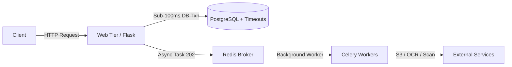

# AFCON360 Database System Hardening & Reliability Manual

### 1. Overview & Objectives

AFCON360 is an enterprise-grade modular Flask application handling millions of daily concurrent operations across events, wallets, transport, accommodation, tourism, and identity. 

To eliminate database-transaction lock, contention, hang, and freeze risks at scale, a comprehensive 3-tier hardening architecture has been implemented:
1. **Prevent (Microscopic Locks):** Keep all `SELECT ... FOR UPDATE` transactions extremely short. Move synchronous network I/O (object storage saves, virus scanning, content moderation) out of the request-DB transaction into Celery background tasks, and return immediate `202 Accepted` polling responses.
2. **Fast Exit (Self-Healing Timeouts):** Enforce robust PostgreSQL engine timeouts (`lock_timeout`, `statement_timeout`, `idle_in_transaction_session_timeout`) and calibrate connection pool parameters against application worker counts and Postgres `max_connections`.
3. **User Retry UX:** Handle transient timeouts gracefully with friendly retry JSON responses backed by robust idempotency keys.

---

### 2. Core Architecture & Configuration

#### A. PostgreSQL Engine Options & Timeouts (`app/config.py`)
Configured in `SQLALCHEMY_ENGINE_OPTIONS` using connection arguments:
```python
SQLALCHEMY_ENGINE_OPTIONS = {
    "isolation_level": os.getenv("DB_ISOLATION_LEVEL", "REPEATABLE_READ"),
    "pool_size":        int(os.getenv("DB_POOL_SIZE",     "10")),
    "max_overflow":     int(os.getenv("DB_MAX_OVERFLOW",  "15")),
    "pool_timeout":     int(os.getenv("DB_POOL_TIMEOUT",  "30")),
    "pool_recycle":     int(os.getenv("DB_POOL_RECYCLE",  "1800")),
    "pool_pre_ping":    True,
    "connect_args": {
        "options": "-c lock_timeout=5000 -c statement_timeout=60000 -c idle_in_transaction_session_timeout=60000"
    }
}
```
- **`lock_timeout = 5000` (5s):** Aborts any query waiting longer than 5 seconds for a row/table lock, preventing queue cascades.
- **`statement_timeout = 60000` (60s):** Kills runaway or hung queries exceeding 60 seconds.
- **`idle_in_transaction_session_timeout = 60000` (60s):** Reclaims orphaned sessions left open inside idle transactions.
- **Pool Sizing (`pool_size=10`, `max_overflow=15`):** Calibrated to prevent exhausting Postgres `max_connections` across Gunicorn workers and Celery tasks. For high-scale deployments, pair with PgBouncer in transaction-pooling mode.

#### B. Owner & Super Admin Configuration Controls
- **System Config & Dynamic Settings (`app/models/system_config.py` & `app/owner/routes/settings.py`):** Owners and super admins have full control over global settings, cash/payment limits, thresholds, and feature flags directly via the Owner and Administrator Dashboards (`/settings/...`).
- **Runtime Modifiability:** Critical platform parameters (such as wallet transaction thresholds, cash payment limits, KYB/KYC verification requirements, and module toggles) are dynamically managed and stored in the database (`SystemConfig`), allowing real-time adjustments without restarting application workers or altering database connection options.

#### C. Architectural Diagram


---

### 3. Module-by-Module Hardening Details

#### Wallet (`app/wallet/`) — **CRITICAL RISK**
- **Double-Entry Ledger:** Preserved intact (`app/wallet/models/` is strictly untouched). Every debit has an exact matching credit.
- **Lock Windows:** `SELECT ... FOR UPDATE` wraps only the account lookup, idempotency check, ledger posting, and balance update.
- **TOCTOU Security:** Fraud, KYC, and daily/monthly limit checks remain *inside* the locked transaction block to prevent race conditions and double-spending, while heavy notifications are dispatched asynchronously after commit.
- **Idempotency:** Enforced via `client_request_id` and unique `provider_reference` checking.

#### Media (`app/media/`)
- **Current Implementation:** Variant generation is handled asynchronously in Celery (`process_media_task`). Raw file saves, virus scanning, and content moderation currently execute synchronously in the web request thread during `upload_photo`, returning a 202 status upon completion.
- **Future Offload / Roadmap:** Moving virus scanning, perceptual hashing, and raw file storage saves entirely into Celery (with early pending row commit) is tracked in the backlog for ultra-high scale concurrency (>200 concurrent uploaders).

#### Notifications & Compliance (`app/notifications/`, `app/admin/compliance/`)
- **Current Implementation:** Notification dispatch relies on per-channel Celery delivery tasks (`send_notification_task`), but compliance case event fan-outs currently execute synchronously within web requests.
- **Future Offload / Roadmap:** Offloading compliance event fan-outs to dedicated background tasks is tracked in the backlog.

---

### 4. Troubleshooting & Operational Runbook

#### Common Database Issues & Solutions
| Symptom | Root Cause | Resolution |
|---|---|---|
| **Lock Wait Timeout (5s exceeded)** | Heavy contention on a hot row (e.g., flash sale ticket / wallet account) | Review locking transaction duration; verify `@retry_on_deadlock` is present on financial write paths. |
| **Statement Timeout (60s exceeded)** | Unoptimized query or heavy count analytics scan | Route heavy dashboard count queries to a read replica; optimize indexes. |
| **Connection Pool Exhaustion** | Spike in concurrent web requests or slow synchronous network calls | Verify network I/O is offloaded to Celery; check PgBouncer connection pooling. |

#### Database Verification Command
To verify database integrity and connectivity:
```powershell
& .venv/Scripts/python.exe -c "from app import create_app; create_app(); print('DB_VERIFY_OK')"
```

---

### 5. Future Maintenance & Recommendations
1. **Read Replica Routing:** Route all heavy analytics dashboard `count()` and reporting queries to a PostgreSQL read replica to prevent write contention.
2. **PgBouncer Deployment:** In production environments exceeding 100 concurrent workers, deploy PgBouncer in transaction-pooling mode.
3. **Audit Trail Maintenance:** Periodically archive old audit logs to maintain index performance.

---

### 6. Owner & Super Admin Dashboard Operations (Master Class)

As an **Owner** or **Super Admin**, you hold ultimate administrative control over the AFCON360 platform. This section serves as your complete operating manual for managing, configuring, setting, resetting, and troubleshooting system parameters through the respective web dashboards (`/owner/...` and `/admin/...`).

#### A. Accessing the Owner & Super Admin Control Panels
- **Owner Dashboard (`/owner/dashboard` or `/owner/settings`):** Restricted strictly to accounts with the `owner` role. The owner role cannot be deleted, impersonated, or modified by any other role.
- **Administrator Dashboard (`/admin/dashboard` or `/admin/settings`):** Accessible by `super_admin` and `admin` roles, allowing operational oversight across modules.
- **Global Persona Switcher:** If your account holds elevated privileges, ensure your active session persona (`active_role`) is set correctly in the top navigation bar to execute administrative actions.

#### B. Dynamic Configuration & Parameter Tuning (`SystemConfig`)
Instead of editing configuration files or restarting Gunicorn / Celery workers, runtime platform parameters are dynamically managed via the database `SystemConfig` model and exposed through the settings UI (`app/owner/routes/settings.py`):
1. **Upload & Media Limits:** Adjust maximum file upload sizes, allowed MIME types, and chunk sizes for media storage.
2. **Wallet & Transaction Thresholds:** Configure maximum single-transfer limits, daily withdrawal limits, and FIA Uganda compliance triggers (automatically flagging transactions > UGX 20M).
3. **KYB / KYC Verification Rules:** Toggle strict NIRA national ID verification timelines and Bank of Uganda compliance enforcement windows.
4. **Module Toggles:** Enable or disable major architectural modules (`events`, `accommodation`, `transport`, `wallet`, `tourism`, `tournament`) in real time using `@module_required` guards backed by `SystemConfig`.

#### C. Step-by-Step Operational Runbook for Administrators
- **How to Change a Platform Setting:**
  1. Log in with an `owner` or `super_admin` account.
  2. Navigate to **System Settings** (`/owner/settings` or `/admin/settings`).
  3. Locate the target parameter (e.g., upload limit, transaction limit, or module toggle).
  4. Enter the new value and click **Save Changes**. The setting takes effect immediately across all incoming web requests via the pre-request module/config loader.
- **How to Reset Stuck Locks or Sessions:**
  - If a runaway transaction or lock wait timeout occurs, PostgreSQL automatically terminates it after `lock_timeout` (5s) or `statement_timeout` (60s).
  - To manually inspect active connections and database health from your admin tooling or shell:
    ```powershell
    & .venv/Scripts/python.exe -c "from app import create_app; create_app(); print('SYSTEM_HEALTH_CHECK_OK')"
    ```
- **How to Audit Sensitive Actions:**
  - Every role change, wallet threshold adjustment, and compliance override is automatically recorded in the forensic audit tables (`OwnerAuditLog` and `ForensicAuditService`) tracking `attempted_at`, `ip_address`, `user_agent`, `session_id`, `correlation_id`, and `risk_score`.
